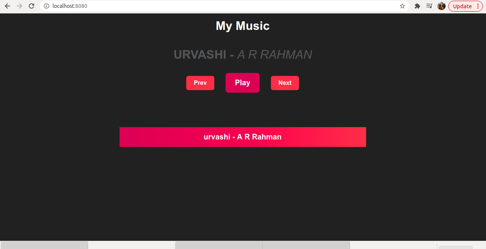

# Music App


## Summary:
This repository provides full source code of a Music web app that uses the HTML5 Audio Element API to play music. It uses VueJS reactive features including lifecycle methods, data and methods to create a beginner friendly music app with playable playlist.




## Set up:
### Requirements:
- Vue js

### Source code:
Clone the repository:
```bash
git clone https://github.com/BHAVIKA44/Musicapp.git
```


